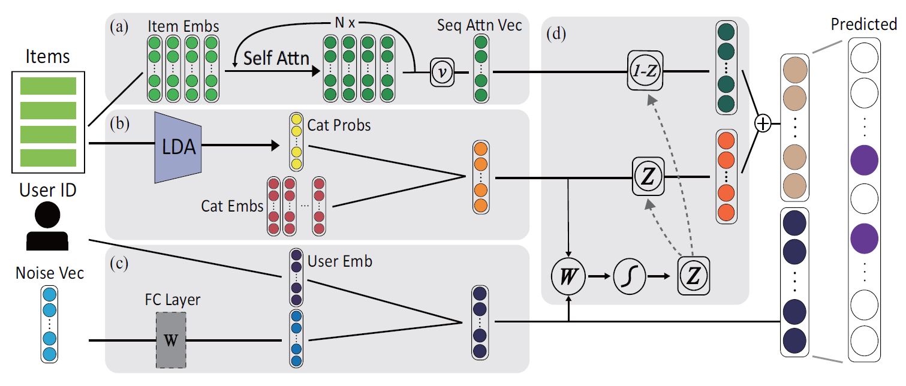
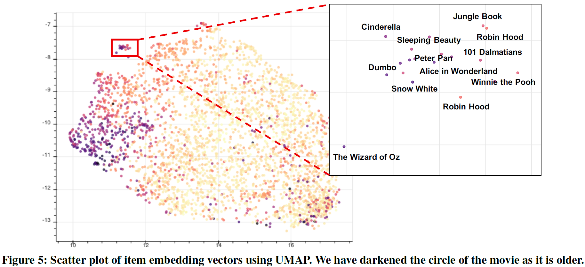

# SelCa

## PyTorch implementation of the sequential recommender system (SelCa)
This repository is PyTorch implementation of [Recommender System Using Sequential and Global Preference via Attention Mechanism and Topic Modeling](https://dl.acm.org/doi/abs/10.1145/3357384.3358054).

I found a minor issue related attention networks in the original codes and fix it.

In addition, I adopted AdamW optimizer and GELU activation function and additionally add dropout layer for the content vector v<sub>content</sub>.

The results for MovieLens (ml1m) are slightly better than those of the original paper.


## Model Overview


The model can consider both global information from the entire user-item interactions and sequential information, e.g. items that the user recently purchased.


## Category Embedding via Topic Modeling




The result shows that our models learn the categorical information, such as genre.

## Diverse Recommendation


By adding the linearly-transformed random noise vector to the user embedding vector, the model can provide diverse recommendations to users while mitigating user information and overffiting.


## Train
You can train this model via the following script.

```
CUDA_VISIBLE_DEVICES=[GPU_ID] python train.py --use_cuda --train_lda --train_data=movielens
```

Once you run train.py, the data file (data_gowalla.pkl or data_movielens.pkl) is generated for caching the lda probabilities. Then, you don't need to pass the --train_lda argument.

See the details in build_lda_probs function in train.py.

The training LDA may take more than 10 minutes. If you reduce the time for training LDA, than you can decrease max_iter in `lda = LatentDirichletAllocation(...)`.


## Results and Hyperparameter settings
I'll share results corresponding to the changed hyperparamter settings after searching the optimal hyperparameter settings.


## Dependency
* Python 3.7+
* PyTorch 1.4
* gensim
* sklearn, scipy


## Citation

If you use this SelCa in your paper, please cite the paper:

```
@inproceedings{kang2019recommender,
  title={Recommender System Using Sequential and Global Preference via Attention Mechanism and Topic Modeling},
  author={Kang, Kyeongpil and Park, Junwoo and Kim, Wooyoung and Choe, Hojung and Choo, Jaegul},
  booktitle={Proceedings of the 28th ACM International Conference on Information and Knowledge Management},
  pages={1543--1552},
  year={2019}
}
```
